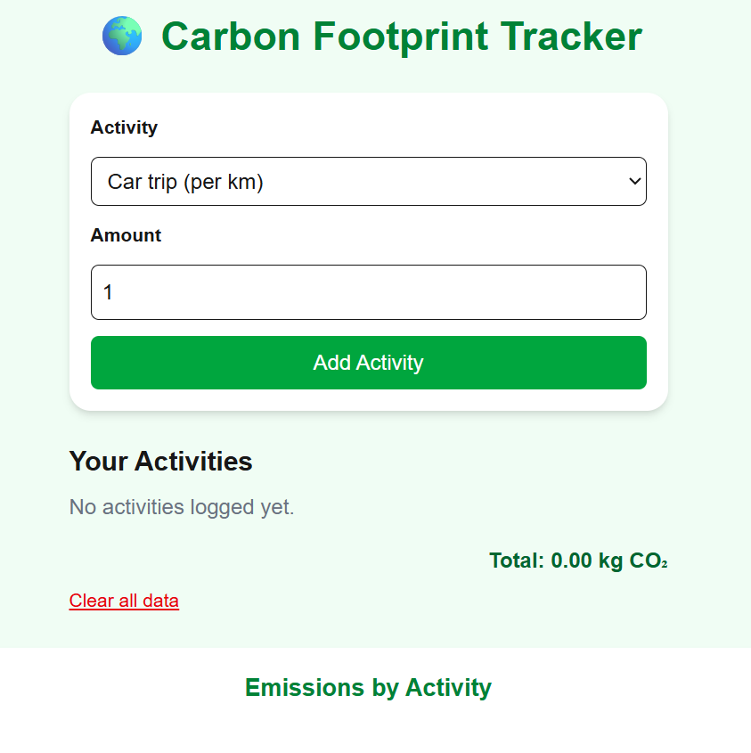
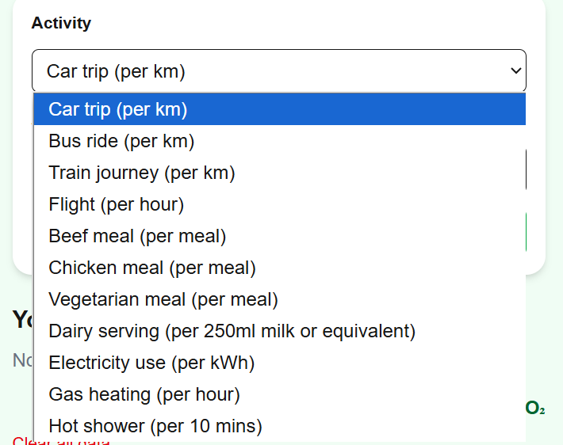
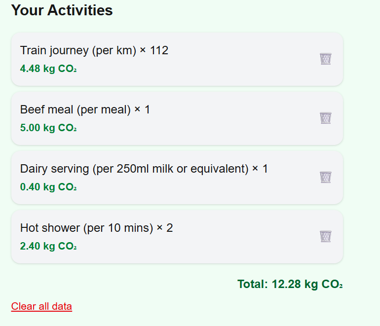
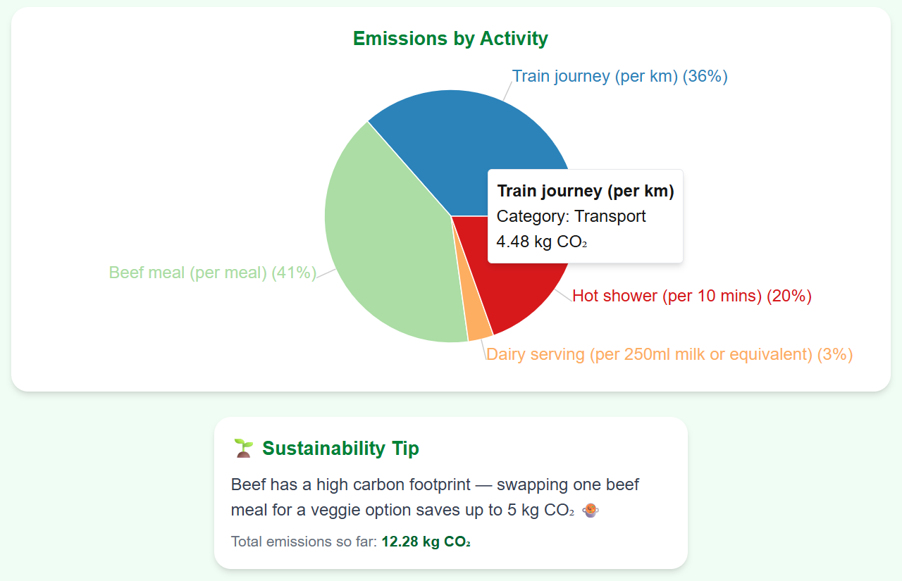

# Carbon Tracker 🌱

**Carbon Tracker** is a simple web app built with **Next.js, React, TypeScript, TailwindCSS, Recharts, and Framer Motion** that lets users track their carbon footprint from daily activities.  
The app allows you to add activities, see the emissions in a list, and visualize your impact with a responsive pie chart. It then suggests some tips to decrease your carbon footprint based on the activity with the highest emmission.

This is a [Next.js](https://nextjs.org) project bootstrapped with [`create-next-app`](https://nextjs.org/docs/app/api-reference/cli/create-next-app).

---

## Requirements

Install dependencies listed in `requirements.txt`:

### Prerequisites

Before you start, make sure you have Node.js installed on your machine: (https://nodejs.org/en/download/)

### Installation

Run the following command to install the necessary dependencies:

```bash
npm install
```

### Running the project

To start the development server, run the following command:

```bash
npm run dev
```

This will start the server and open your default browser to your localhost. The site will reload automatically as you make changes to your code.

## Demo

Some screenshots of the app in action:





